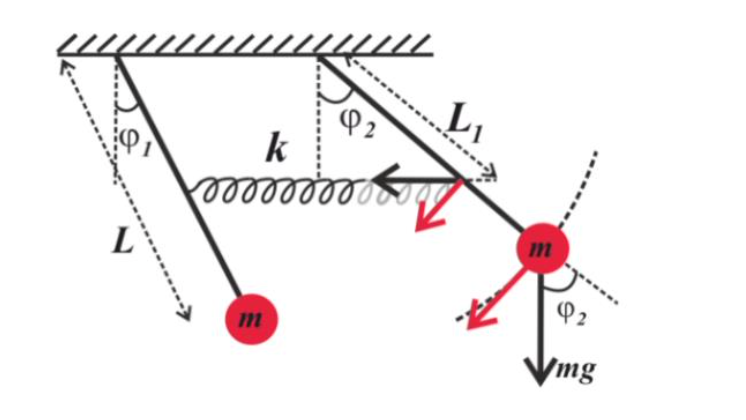

# coupled-pendulum-model
## Задание:
Два одинаковых математических маятника, связанных пружиной с коэффициентом жёсткости 𝑘 на расстоянии 𝐿1 от точки крепления маятников. Точки крепления обоих связанных маятников находятся на одном уровне. Оба математических маятника имеют одинаковые длины подвеса 𝐿 и массы 𝑚.

Сила сопротивления для каждого маятника прямо пропорциональна скорости. Коэффициент затухания каждого маятника равен β. Для заданных начальных отклонений построить графики зависимостей углов и скоростей от времени для каждого маятника. Найти нормальные частоты. Параметры должны задаваться.
